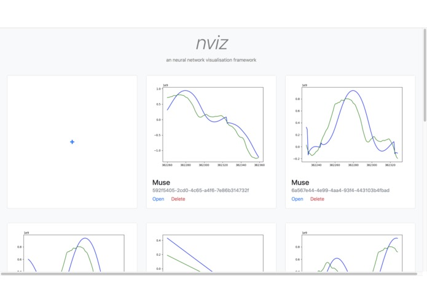
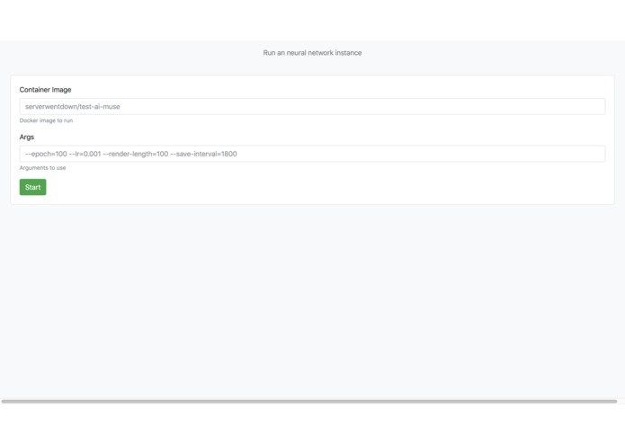
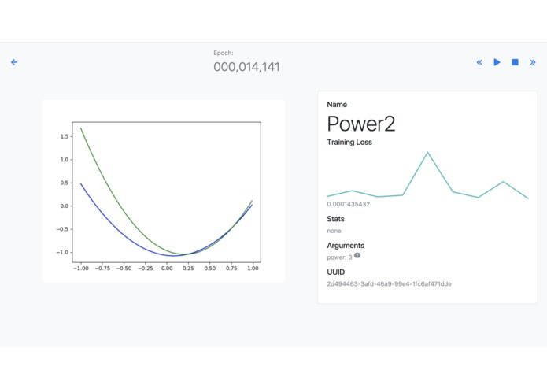

# nviz
A real-time visualization tool to train neural networks

## Inspiration
Training neural networks can be a really painstaking process, involving a lot of trial and error and waiting time. One major part of that problem arises from how most neural networks, while being trained, output minimal data which is usually limited to the loss value. That means that you never quite know what the neural network is doing, only that it is supposedly getting "better" at it. At the end of the day after training is complete, it is very likely that the neural network is outputting something not even close to what we initially wanted. And just like that, hours of our time go to waste.

The solution to that is pretty simple. We needed a real time visualization tool, capable of showing us statistics of how the neural network is doing along with the output at each stage, such that we can determine if the neural network is training down the right path at one glance. This simplifies the whole process and makes debugging a whole lot easier, along with making for a pretty cool demo.

## What it does
nviz stands for neural network visualization and it is a tool that enables developers to easily look at the real-time state of a neural network as it is training. This concept builds upon 3 fundamental features.

* Visualization of output
* Simplified management of training
* Testing environment

nviz uses a web-based interface to allow developers to interact with their training neural networks remotely without having to go through any command line tools. The web interface is fully responsive under 144px and looks great on both desktop and mobile environments. It provides a slew of output data, listed below.

* Neural network output
* Loss value and graph
* Arguments
* Stats

Additionally, it allows developers to start and stop training along with creating multiple instances of the neural network with different parameters such that multiple parameter options can be tested at the same time. The elegant user interface combined with the utility of the tool makes it a fun and easy to use service.

## How we built it
The project is divided into 3 parts, namely the python wrapper, back-end and front-end. Each of the sections is explained in detail below.

### Python wrapper
We chose Python as the main language because many major neural network libraries such as TensorFlow and PyTorch, are primarily based off of Python. But, we wanted to make as little changes to existing python scripts in order to use nviz. Thus, we created a small wrapper that helps interface existing scripts to nviz. It is a simple script that interfaces to the REST API so that the end user can conveniently implement it into their existing neural network python code.

### Go backend
The Go backend we wrote streams and stores the data coming out of the neural networks it manages. Neural networks wrapped in the wrapper will call the API when they start and add themselves to the dashboard. They will also publish data to the backend. The backend will then stream the data using server sent events to the browser. It also manages the Docker containers created from the dashboard through the Docker api, and these containers can run on any Docker host (can run on a different machine or be scheduled onto multiple machines using Docker swarm). This backend can also run on any platform (macOS , windows, linux) using a single 10MB binary.

### Dashboard
The dashboard displays the state of the neural networks and allows you to get their data and stats. It has a interface to start Docker containers without going into the command line, making it really easy to spawn and manage multiple neural nets with different parameters that share the same code.

It uses bootstrap as a base framework with Vue.js. It also employs the modern ES6, Fetch API, Server Sent Events web standards

## What's next for nviz
The long term plan for nviz would be to create a service, similar to those provided by ThingSpeak for IoT. An online subscription based service for developers to manage, monitor and ensure that their training is successful would be an immensely useful tool for the developer community. We need to look into several more aspects to get to that point. Firstly, we need to work on the security, login interface and user management interface. The UI also has much room for improvement and this is very much a proof of concept. The Docker container interface can be also made much more customizable and extensible to add value to the service as a management platform.
